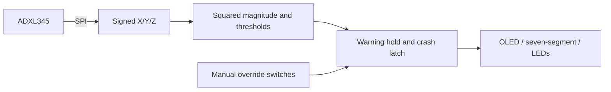

# FPGA motion-triggered warning prototype

[Portfolio](https://github.com/agmanuel-dev) | [Technical details](#technical-details) | [File guide](#file-guide)

This project turns movement of a sensor into visible status signals on an FPGA board. Shaking the accelerometer can trigger a warning/crash state; switches also allow manual demonstrations. The original distance-based collision-warning goal was not completed.

**My contribution:** I built the manual crash controls and OLED display functionality with AI assistance, connected the hardware to the FPGA board, and attempted the unsuccessful distance-sensor integration. The working accelerometer triggers, LEDs, OLED and switches are my reported results from the original build. [Full contribution record](PROVENANCE.md).

## Technical details

A Basys-3 / Artix-7 coursework prototype with author-reported working accelerometer triggering, manual controls, OLED and LEDs. The original goal was to measure distance between objects and signal a potential collision. The distance sensor could not be made to work with the board, so the project continued with an accelerometer-only design. The published Verilog implements an ADXL345 SPI interface and a SAFE / WARNING / CRASH state machine with display and LED outputs.

**Focus:** Verilog integration, stateful control, peripheral interfaces and simulation.

## Project outcome

The original distance-based collision-warning goal was not completed. Accelerometer thresholds respond to motion/acceleration; they do not measure object separation or establish that a collision is approaching. This repository contains the accelerometer-based implementation, not a working distance-sensing system.

The following hardware results were reported by Alexander Gaspar Manuel from the original coursework build:

| Feature | Original hardware result |
|---|---|
| LEDs | Worked |
| OLED screen | Worked |
| Switches and manual crash triggers | Worked |
| Distance sensor | Did not work with the FPGA board; integration attempts were unsuccessful and work on that sensor stopped |
| Accelerometer-triggered automatic warning/crash detection | Moving or shaking the accelerometer automatically changed the warning/crash state on the physical board |

The distance-sensor model, specific troubleshooting steps and failure cause are not documented here. These reported hardware results refer to the original build, before the September 2026 source changes. The simulation results below are separate checks and do not establish end-to-end sensor operation.

## My contribution

I built the manual crash-detector controls and OLED display functionality with AI assistance, and personally connected the hardware to the FPGA board. I also attempted to integrate the distance sensor, but did not resolve the issue. This account describes my contribution; it does not claim that I independently authored every module in the repository.

## Implemented architecture



## Behavior implemented in the source

- A scaled squared magnitude above 1,200 enters WARNING; above 1,800 enters CRASH.
- WARNING persists for a configured hold interval after detection stops. CRASH latches until reset or manual override.
- Switch 15 enables manual override; switches 1:0 select SAFE (`00`), WARNING (`10`) or CRASH (`01`).
- The automatic crash latch controls LED blinking. Selecting CRASH manually changes displays but intentionally clears that latch.

## Hardware and source

Target: Basys-3 (`xc7a35tcpg236-1`), 100 MHz input clock. The source expects an ADXL345 SPI connection on JA and an SPI OLED interface on JB. Verify your module pinout and power requirements against its documentation before connecting it.

| Connection | Signals |
|---|---|
| JA1–JA4 | chip select, MOSI, MISO, SCLK |
| JB1, JB2, JB4 | OLED chip select, MOSI, SCLK |
| JB7–JB10 | data/command, reset, VCC enable, PMOD enable |
| Center button | Reset |

`top.v` integrates the design. `adxl345_spi.v` contains the sensor interface modules; `oled_controller_full.v`, `spi_master_oled.v` and `display_ctrl.v` drive outputs. `Basys3.xdc` includes only ports used by this design.

## Reproduce the simulation

Run from this directory in a terminal with Vivado tools on PATH:

```text
xvlog top.v adxl345_spi.v ClkDiv_5Hz.v display_ctrl.v oled_controller_full.v spi_master_oled.v
xvlog --sv test_crash.v
xelab test_crash -s crash_test
xsim crash_test -runall
```

Create a fresh portable Vivado project with `vivado -mode batch -source create_project.tcl`. No cached checkpoint is required by the source simulation or project-creation script.

## Verification and corrections

Vivado Simulator 2025.1 passed the supplied test on September 12, 2026. It checks reset, manual override, automatic warning, warning hold, automatic crash detection, latching and recovery by injecting acceleration values at the sensor output boundary. Timing parameters are shortened for simulation; hardware defaults are preserved.

Portfolio preparation widened the warning timer from 27 to 32 bits, made timing configurable, corrected a scale comment, removed unused pin constraints and replaced the original testbench that timed out before later checks. See [PROVENANCE.md](PROVENANCE.md).

## Limits

This is an educational acceleration-threshold prototype, not a validated vehicle safety system. Thresholds are raw scaled counts, not calibrated crash criteria. The start/enable waveform is about 5 Hz, but the sensor controller may repeat reads while it remains high; this is not a guaranteed fixed 5 Hz sample stream. Also, debounce counts FPGA clocks rather than independent sensor samples. The simulation does not validate real SPI transactions, OLED pixels, sensor calibration, physical timing closure or current hardware operation. Board testing remains necessary after these changes.


### Details to account for when extending the prototype

- The seven-segment display shows state messages, not measured distance or acceleration values. `CALL 911` is display text only.
- Manual switch value `11` is not a named state: the seven-segment output is blank while the OLED uses its default appearance.
- The LED bar uses a coarse integer mapping, not a calibrated gauge. Below the warning threshold it uses `floor(scaled_magnitude / 128)`, so the bar can drop from nine to eight LEDs when crossing 1,200.
- WARNING uses a hold timer, not separate entry/exit thresholds. The short confirmation counters count FPGA clocks, not independent sensor readings.
- OLED color and face settings are retained from the coursework. Their appearance and serial timing are not checked by the supplied state-machine test.

## File guide

| File | Purpose |
|---|---|
| [top.v](top.v) | Connects modules and implements thresholds, warning hold, crash latch and LED logic. |
| [adxl345_spi.v](adxl345_spi.v) | Accelerometer configuration, serial transfers and axis registers. |
| [ClkDiv_5Hz.v](ClkDiv_5Hz.v) | Approximately 5 Hz enable waveform used by the sensor controller. |
| [display_ctrl.v](display_ctrl.v) | Seven-segment SAFE, WARNING and CALL 911 messages; no emergency call is placed. |
| [oled_controller_full.v](oled_controller_full.v) | OLED initialization, background and face drawing commands. |
| [spi_master_oled.v](spi_master_oled.v) | Single-byte serial transmitter used by the OLED controller. |
| [test_crash.v](test_crash.v) | Logic simulation with injected acceleration values, not a physical sensor model. |
| [Basys3.xdc](Basys3.xdc) | Board pin assignments and clock constraint. |
| [create_project.tcl](create_project.tcl) | Creates a Vivado project from the source files. |
| [README.md](README.md) | Overview, evidence, setup and limitations. |
| [PROVENANCE.md](PROVENANCE.md) | Coursework origins, assistance and contribution record. |
| [.gitignore](.gitignore) | Excludes local caches and generated files. |
